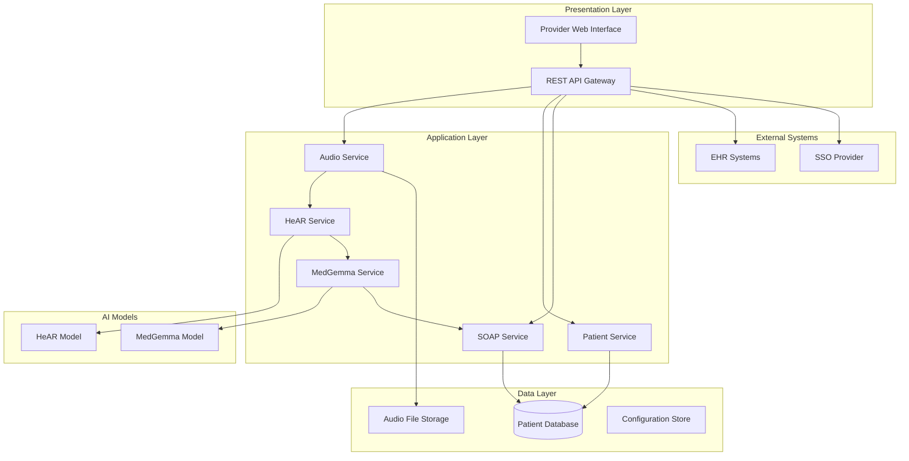

# Design Document: AI Tele-Triage Application

## Overview

The AI Tele-Triage Application is a comprehensive telehealth system that leverages advanced AI models to analyze patient voice input and generate structured medical documentation. The system integrates Google's HeAR (Health Acoustic Representations) model for acoustic anomaly detection with MedGemma for medical analysis, automatically producing SOAP (Subjective, Objective, Assessment, Plan) notes to streamline healthcare provider workflows.

The architecture follows a microservices pattern with clear separation between audio processing, AI model inference, medical analysis, and user interface components. This design ensures scalability, maintainability, and compliance with healthcare regulations while providing real-time processing capabilities for clinical environments.

## Architecture

The system employs a layered architecture with the following key components:



### Component Responsibilities

- **API Gateway**: Request routing, authentication, rate limiting, and response aggregation
- **Audio Service**: Voice capture, preprocessing, format conversion, and quality validation
- **HeAR Service**: Interface to HeAR model for acoustic anomaly detection
- **MedGemma Service**: Interface to MedGemma model for medical analysis and reasoning
- **SOAP Service**: SOAP note generation, formatting, and template management
- **Patient Service**: Patient record management, session tracking, and data persistence

## Components and Interfaces

### Audio Processing Component

The Audio Processing Component handles voice input capture, preprocessing, and quality validation before forwarding to AI models.

**Key Features:**
- Multi-format audio support (WAV, MP3, real-time streaming)
- Noise reduction and audio enhancement
- Quality validation and feedback
- Chunking for real-time processing

**Interface:**
```typescript
interface AudioProcessor {
  captureAudio(sessionId: string): Promise<AudioStream>
  preprocessAudio(audio: AudioData): Promise<ProcessedAudio>
  validateQuality(audio: ProcessedAudio): QualityReport
  convertFormat(audio: AudioData, targetFormat: AudioFormat): Promise<AudioData>
}

interface ProcessedAudio {
  data: ArrayBuffer
  sampleRate: number
  duration: number
  format: AudioFormat
  qualityScore: number
}
```

### HeAR Model Integration

The HeAR Service provides a clean interface to Google's HeAR model for acoustic anomaly detection, handling model loading, inference, and result interpretation.

**Key Features:**
- Acoustic pattern analysis for respiratory, cardiac, and neurological conditions
- Confidence scoring for detected anomalies
- Batch and real-time processing support
- Model version management

**Interface:**
```typescript
interface HeARService {
  analyzeAudio(audio: ProcessedAudio): Promise<AcousticAnalysis>
  getModelInfo(): ModelInfo
  updateModel(version: string): Promise<void>
}

interface AcousticAnalysis {
  anomalies: AcousticAnomaly[]
  overallScore: number
  processingTime: number
  modelVersion: string
}

interface AcousticAnomaly {
  type: 'respiratory' | 'cardiac' | 'neurological' | 'vocal'
  severity: 'low' | 'medium' | 'high'
  confidence: number
  timeRange: { start: number; end: number }
  description: string
}
```

### MedGemma Integration

The MedGemma Service interfaces with Google's MedGemma model to provide medical analysis, differential diagnosis, and clinical reasoning based on acoustic findings and patient information.

**Key Features:**
- Multimodal analysis combining acoustic data with patient history
- Differential diagnosis generation with confidence levels
- Clinical reasoning and recommendation generation
- Integration with medical knowledge bases

**Interface:**
```typescript
interface MedGemmaService {
  analyzeMedical(input: MedicalInput): Promise<MedicalAnalysis>
  generateDifferentials(symptoms: Symptom[], acoustics: AcousticAnalysis): Promise<Differential[]>
  assessUrgency(analysis: MedicalAnalysis): UrgencyLevel
}

interface MedicalInput {
  patientHistory: PatientHistory
  currentSymptoms: Symptom[]
  acousticFindings: AcousticAnalysis
  vitalSigns?: VitalSigns
}

interface MedicalAnalysis {
  differentials: Differential[]
  urgencyLevel: UrgencyLevel
  recommendations: Recommendation[]
  confidence: number
  reasoning: string
}
```

### SOAP Note Generation

The SOAP Service generates structured medical documentation following standard SOAP format, incorporating findings from both AI models and provider input.

**Key Features:**
- Automated SOAP note generation from structured data
- Template-based formatting with customization options
- Medical terminology validation and standardization
- Integration with EHR export formats

**Interface:**
```typescript
interface SOAPService {
  generateNote(session: TriageSession): Promise<SOAPNote>
  formatNote(note: SOAPNote, template: SOAPTemplate): Promise<string>
  validateNote(note: SOAPNote): ValidationResult
  exportNote(note: SOAPNote, format: ExportFormat): Promise<ExportedNote>
}

interface SOAPNote {
  subjective: SubjectiveSection
  objective: ObjectiveSection
  assessment: AssessmentSection
  plan: PlanSection
  metadata: NoteMetadata
}
```

## Data Models

### Core Domain Models

```typescript
interface Patient {
  id: string
  demographics: Demographics
  medicalHistory: MedicalHistory
  allergies: Allergy[]
  medications: Medication[]
  emergencyContact: Contact
  createdAt: Date
  updatedAt: Date
}

interface TriageSession {
  id: string
  patientId: string
  providerId: string
  status: SessionStatus
  audioData: AudioData
  acousticAnalysis?: AcousticAnalysis
  medicalAnalysis?: MedicalAnalysis
  soapNote?: SOAPNote
  startTime: Date
  endTime?: Date
}

interface Demographics {
  firstName: string
  lastName: string
  dateOfBirth: Date
  gender: Gender
  phoneNumber: string
  email?: string
  address: Address
}

interface MedicalHistory {
  conditions: MedicalCondition[]
  surgeries: Surgery[]
  familyHistory: FamilyHistory[]
  socialHistory: SocialHistory
}
```

### SOAP Note Structure

```typescript
interface SubjectiveSection {
  chiefComplaint: string
  historyOfPresentIllness: string
  reviewOfSystems: SystemReview[]
  patientReportedSymptoms: string[]
}

interface ObjectiveSection {
  vitalSigns: VitalSigns
  physicalExam: PhysicalExam
  acousticFindings: AcousticFindings
  diagnosticResults?: DiagnosticResult[]
}

interface AssessmentSection {
  primaryDiagnosis: Diagnosis
  differentialDiagnoses: Diagnosis[]
  riskStratification: RiskLevel
  clinicalImpression: string
}

interface PlanSection {
  treatments: Treatment[]
  medications: PrescribedMedication[]
  followUp: FollowUpPlan
  patientEducation: string[]
  referrals?: Referral[]
}
```

Now I need to use the prework tool to analyze the acceptance criteria before writing the Correctness Properties section.

## Correctness Properties

*A property is a characteristic or behavior that should hold true across all valid executions of a system—essentially, a formal statement about what the system should do. Properties serve as the bridge between human-readable specifications and machine-verifiable correctness guarantees.*

Based on the requirements analysis, the following properties define the correctness criteria for the AI Tele-Triage Application:

### Audio Processing Properties

**Property 1: Audio Capture Initiation**
*For any* triage session initiation, the Audio_Processor should successfully capture voice input and produce valid audio data
**Validates: Requirements 1.1**

**Property 2: Audio Format Conversion**
*For any* input audio in supported formats, the Audio_Processor should convert it to HeAR-compatible format without data loss
**Validates: Requirements 1.2**

**Property 3: Audio Quality Validation**
*For any* audio input with insufficient quality, the system should notify the provider and request improvement
**Validates: Requirements 1.3**

**Property 4: Noise Reduction Application**
*For any* audio input with background noise exceeding acceptable levels, the Audio_Processor should apply noise reduction filtering
**Validates: Requirements 1.4**

**Property 5: Multi-format Audio Support**
*For any* audio input in WAV, MP3, or real-time streaming format, the Audio_Processor should successfully process it
**Validates: Requirements 1.5**

### HeAR Model Properties

**Property 6: Acoustic Analysis Execution**
*For any* processed audio input, the HeAR_Model should analyze it and return acoustic anomaly results
**Validates: Requirements 2.1**

**Property 7: Anomaly Classification**
*For any* detected acoustic anomalies, the HeAR_Model should classify them by type and severity with confidence scores
**Validates: Requirements 2.2, 2.3**

**Property 8: HeAR Processing Performance**
*For any* audio input, the HeAR_Model should complete processing within 30 seconds of input completion
**Validates: Requirements 2.4**

**Property 9: Negative Result Handling**
*For any* audio input with no detectable anomalies, the HeAR_Model should return a clear negative result
**Validates: Requirements 2.5**

### MedGemma Model Properties

**Property 10: Medical Insight Generation**
*For any* combination of acoustic analysis and patient symptoms, the MedGemma_Model should generate medical insights
**Validates: Requirements 3.1**

**Property 11: Comprehensive Input Consideration**
*For any* medical analysis request, the MedGemma_Model should consider patient history, current symptoms, and acoustic findings in its analysis
**Validates: Requirements 3.2**

**Property 12: Differential Diagnosis Provision**
*For any* completed medical analysis, the MedGemma_Model should provide differential diagnoses with confidence levels
**Validates: Requirements 3.3**

**Property 13: Urgent Condition Identification**
*For any* medical analysis containing urgent conditions, the MedGemma_Model should identify and flag them for immediate attention
**Validates: Requirements 3.4**

**Property 14: Insufficient Data Handling**
*For any* medical analysis request with insufficient data, the MedGemma_Model should request additional patient information
**Validates: Requirements 3.5**

### SOAP Note Generation Properties

**Property 15: Complete SOAP Note Structure**
*For any* completed triage session, the generated SOAP_Note should contain all required sections (Subjective, Objective, Assessment, Plan) with appropriate content from the session data
**Validates: Requirements 4.1, 4.2, 4.3, 4.4, 4.5**

**Property 16: Medical Terminology Standards**
*For any* generated SOAP note, the content should maintain medical terminology standards and proper formatting
**Validates: Requirements 4.6**

### User Interface Properties

**Property 17: Provider Dashboard Display**
*For any* provider login, the system should display a dashboard containing pending and completed sessions
**Validates: Requirements 5.1**

**Property 18: Triage Workflow Guidance**
*For any* new session initiation, the system should guide the provider through the complete triage workflow
**Validates: Requirements 5.2**

**Property 19: Real-time Processing Feedback**
*For any* audio processing operation, the system should display real-time status and progress indicators
**Validates: Requirements 5.3**

**Property 20: Results Presentation Format**
*For any* completed analysis, the system should present findings in a clear, organized format
**Validates: Requirements 5.4**

**Property 21: SOAP Note Editing Capability**
*For any* generated SOAP note, providers should be able to edit and annotate it before finalization
**Validates: Requirements 5.5**

**Property 22: Critical Findings Highlighting**
*For any* urgent conditions detected, the system should prominently highlight critical findings in the interface
**Validates: Requirements 5.6**

### Patient Record Management Properties

**Property 23: Secure Patient Record Creation**
*For any* new patient registration, the system should create a secure Patient_Record with proper encryption
**Validates: Requirements 6.1**

**Property 24: Session Data Persistence**
*For any* completed triage session, the system should store session data and SOAP note in the Patient_Record
**Validates: Requirements 6.2**

**Property 25: Chronological History Display**
*For any* patient history access, the system should display session summaries in chronological order
**Validates: Requirements 6.3**

**Property 26: Patient Record Search Functionality**
*For any* search criteria applied to patient records, the system should return correctly filtered results
**Validates: Requirements 6.4**

**Property 27: Healthcare Data Format Compliance**
*For any* patient data export, the system should format it according to healthcare interoperability standards (HL7, FHIR)
**Validates: Requirements 6.6, 9.3**

### Security and Compliance Properties

**Property 28: Data Encryption Implementation**
*For any* patient data storage or transmission, the system should use AES-256 encryption
**Validates: Requirements 7.1**

**Property 29: Role-based Access Control**
*For any* user access attempt, the system should enforce role-based permissions appropriate to the user type
**Validates: Requirements 7.2**

**Property 30: Comprehensive Audit Logging**
*For any* data access or modification operation, the system should maintain detailed audit logs with timestamps and user information
**Validates: Requirements 6.5, 7.4**

**Property 31: Breach Notification System**
*For any* detected data breach, the system should immediately notify administrators and affected parties
**Validates: Requirements 7.5**

**Property 32: Data Retention and Deletion**
*For any* data subject to retention policies, the system should properly manage lifecycle and secure deletion
**Validates: Requirements 7.6**

### Performance Properties

**Property 33: End-to-end Processing Performance**
*For any* complete triage session, the system should process from audio input to SOAP note generation within 5 minutes
**Validates: Requirements 8.1**

**Property 34: High Load Request Queuing**
*For any* high system load condition, the system should queue requests and provide estimated processing times
**Validates: Requirements 8.3**

**Property 35: Automated Backup Execution**
*For any* 4-hour interval, the system should automatically backup all data
**Validates: Requirements 8.4**

**Property 36: Concurrent Session Support**
*For any* concurrent provider sessions up to 100, the system should handle them without performance degradation
**Validates: Requirements 8.6**

### Integration Properties

**Property 37: EHR System Integration**
*For any* EHR integration request, the system should successfully communicate via HL7 FHIR APIs
**Validates: Requirements 9.1**

**Property 38: SSO Authentication Integration**
*For any* SSO authentication attempt, the system should successfully integrate with hospital authentication systems
**Validates: Requirements 9.2**

**Property 39: REST API Availability**
*For any* third-party integration request, the system should provide functional REST APIs
**Validates: Requirements 9.4**

**Property 40: Webhook Notification Delivery**
*For any* system event requiring external notification, the system should send webhook notifications to configured endpoints
**Validates: Requirements 9.5**

### Model Management Properties

**Property 41: Model Hot-swapping Capability**
*For any* model version update, the system should support hot-swapping of HeAR_Model and MedGemma_Model without service downtime
**Validates: Requirements 10.1**

**Property 42: Controlled Model Deployment**
*For any* new model version availability, the system should provide controlled deployment mechanisms
**Validates: Requirements 10.2**

**Property 43: Model Performance Metrics Collection**
*For any* model execution, the system should maintain performance metrics and accuracy statistics
**Validates: Requirements 10.3**

**Property 44: Performance Degradation Alerting**
*For any* model performance degradation, the system should alert administrators and suggest corrective actions
**Validates: Requirements 10.4**

**Property 45: A/B Testing Support**
*For any* A/B testing configuration, the system should route users to different model versions according to the test parameters
**Validates: Requirements 10.5**

## Error Handling

The system implements comprehensive error handling across all components to ensure reliability and user safety in clinical environments:

### Audio Processing Errors
- **Invalid Audio Format**: Return format error with supported format list
- **Audio Quality Issues**: Provide specific feedback on quality problems (noise, distortion, volume)
- **Processing Timeouts**: Implement graceful timeout handling with user notification
- **Storage Failures**: Retry mechanism with fallback to alternative storage

### AI Model Errors
- **Model Unavailability**: Fallback to cached results or alternative analysis methods
- **Inference Failures**: Retry with different parameters, escalate to human review
- **Confidence Threshold Issues**: Flag low-confidence results for provider review
- **Model Version Conflicts**: Automatic rollback to previous stable version

### Data Persistence Errors
- **Database Connection Issues**: Connection pooling with automatic retry
- **Data Validation Failures**: Detailed validation error messages with correction guidance
- **Concurrent Access Conflicts**: Optimistic locking with conflict resolution
- **Backup Failures**: Multiple backup strategies with failure alerting

### Integration Errors
- **EHR Communication Failures**: Queue operations for retry, maintain local cache
- **Authentication Errors**: Clear error messages with troubleshooting guidance
- **API Rate Limiting**: Implement backoff strategies and request queuing
- **Network Connectivity Issues**: Offline mode with data synchronization

## Testing Strategy

The testing strategy employs a dual approach combining unit testing for specific scenarios with property-based testing for comprehensive validation:

### Unit Testing Approach
Unit tests focus on specific examples, edge cases, and integration points:
- **Component Integration**: Test interfaces between audio processing, AI models, and SOAP generation
- **Edge Case Validation**: Test boundary conditions, empty inputs, and malformed data
- **Error Condition Testing**: Verify proper error handling and recovery mechanisms
- **Security Testing**: Validate encryption, access control, and audit logging
- **Performance Benchmarking**: Test specific performance scenarios and resource usage

### Property-Based Testing Configuration
Property-based testing validates universal properties across randomized inputs:
- **Testing Framework**: Use Hypothesis (Python) or fast-check (TypeScript) for property-based testing
- **Test Iterations**: Minimum 100 iterations per property test to ensure comprehensive coverage
- **Input Generation**: Custom generators for medical data, audio samples, and patient records
- **Shrinking Strategy**: Automatic test case minimization for failure analysis
- **Regression Testing**: Property tests serve as regression suite for system changes

### Test Tagging and Organization
Each property-based test must reference its corresponding design property:
- **Tag Format**: `Feature: ai-tele-triage, Property {number}: {property_text}`
- **Test Organization**: Group tests by component (audio, HeAR, MedGemma, SOAP, UI)
- **Coverage Tracking**: Monitor property coverage and identify untested requirements
- **Continuous Integration**: Automated test execution on code changes and deployments

### Healthcare-Specific Testing Considerations
- **Synthetic Data Generation**: Use synthetic patient data that maintains statistical properties of real data
- **Compliance Validation**: Automated testing of HIPAA compliance and audit trail requirements
- **Clinical Workflow Testing**: End-to-end testing of complete triage workflows
- **Interoperability Testing**: Validation against HL7 FHIR standards and EHR integration
- **Performance Under Load**: Testing with realistic clinical workloads and concurrent users